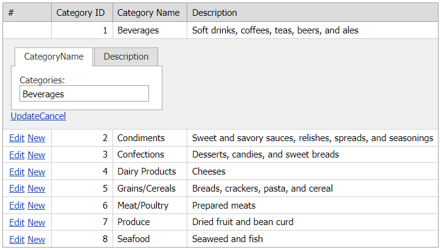

<!-- default badges list -->

[](https://supportcenter.devexpress.com/ticket/details/E986)
[](https://docs.devexpress.com/GeneralInformation/403183)
<!-- default badges end -->
# Grid View for ASP.NET Web Forms - How to create edit form templates dynamically
<!-- run online -->
**[[Run Online]](https://codecentral.devexpress.com/128538784/)**
<!-- run online end -->
This example demonstrates how to implement the ITemplate interface to create an edit form template dynamically.



## Overview

Follow the steps below to create an edit form template dynamically:

1. Use the [ITemplate](https://learn.microsoft.com/en-us/dotnet/api/system.web.ui.itemplate?redirectedfrom=MSDN&view=netframework-4.8.1) interface to create an edit form template and call the [InstantiateIn](https://learn.microsoft.com/en-us/dotnet/api/system.web.ui.itemplate.instantiatein?view=netframework-4.8.1) method to populate the template with editors.

    ```csharp
    public class EdiFormTemplate:ITemplate{
        private ASPxGridView _gridView;
        public ASPxGridView Grid {
            get {
                return _gridView;
            }
            set {
                _gridView = value;
            }
        }
        public EdiFormTemplate(){
	    }
        public void InstantiateIn(Control container){
            int index = (container as GridViewEditFormTemplateContainer).VisibleIndex;
        // ...
        }
    }
    ```

2. To add **Update** and **Cancel** command buttons to the edit form, create a template replacement - add a [GridViewTemplateReplacement](https://docs.devexpress.com/AspNet/DevExpress.Web.ASPxGridViewTemplateReplacement) object and specify its [ReplacementType](https://docs.devexpress.com/AspNet/DevExpress.Web.ASPxGridViewTemplateReplacement.ReplacementType) property.

    ```csharp
    public void InstantiateIn(Control container){
        // ...
        ASPxGridViewTemplateReplacement upd = new ASPxGridViewTemplateReplacement();
        upd.ReplacementType = GridViewTemplateReplacementType.EditFormUpdateButton;
        upd.ID = "Update";
        container.Controls.Add(upd);

        ASPxGridViewTemplateReplacement can = new ASPxGridViewTemplateReplacement();
        can.ReplacementType = GridViewTemplateReplacementType.EditFormCancelButton;
        can.ID = "Cancel";
        container.Controls.Add(can);
    }
    ```

3. In the `Page_Load` event handler, assign the new template to the grid's `EditForm` propety.

    ```csharp
    protected void Page_Load(object sender, EventArgs e){
        ASPxGridView1.Templates.EditForm = template;
        template.Grid = ASPxGridView1;
    }
    ```

4. To access an editor within the template, call the grid's server-side [FindEditFormTemplateControl](https://docs.devexpress.com/AspNet/DevExpress.Web.ASPxGridView.FindEditFormTemplateControl(System.String)) method.

    ```csharp
    protected void ASPxGridView1_RowUpdating(object sender, DevExpress.Web.Data.ASPxDataUpdatingEventArgs e){
        ASPxPageControl pg = ((ASPxGridView)sender).FindEditFormTemplateControl("ASPxPageControl1") as ASPxPageControl;
        // ...
    }
    ```

## Files to Review

* [EdiFormTemplate.cs](./CS/WebSite/App_Code/EdiFormTemplate.cs) (VB: [EdiFormTemplate.vb](./VB/WebSite/App_Code/EdiFormTemplate.vb))
* [Default.aspx](./CS/WebSite/Default.aspx) (VB: [Default.aspx](./VB/WebSite/Default.aspx))
* [Default.aspx.cs](./CS/WebSite/Default.aspx.cs) (VB: [Default.aspx.vb](./VB/WebSite/Default.aspx.vb))

## Documentation

* [Grid View Templates](https://docs.devexpress.com/AspNet/3718/components/grid-view/concepts/templates)

## More Examples

* [Grid View for ASP.NET Web Forms - How to add an editor to an edit form template at runtime](https://github.com/DevExpress-Examples/aspxgridview-how-to-load-usercontrol-within-editformtemplate-at-runtime-e3735)
